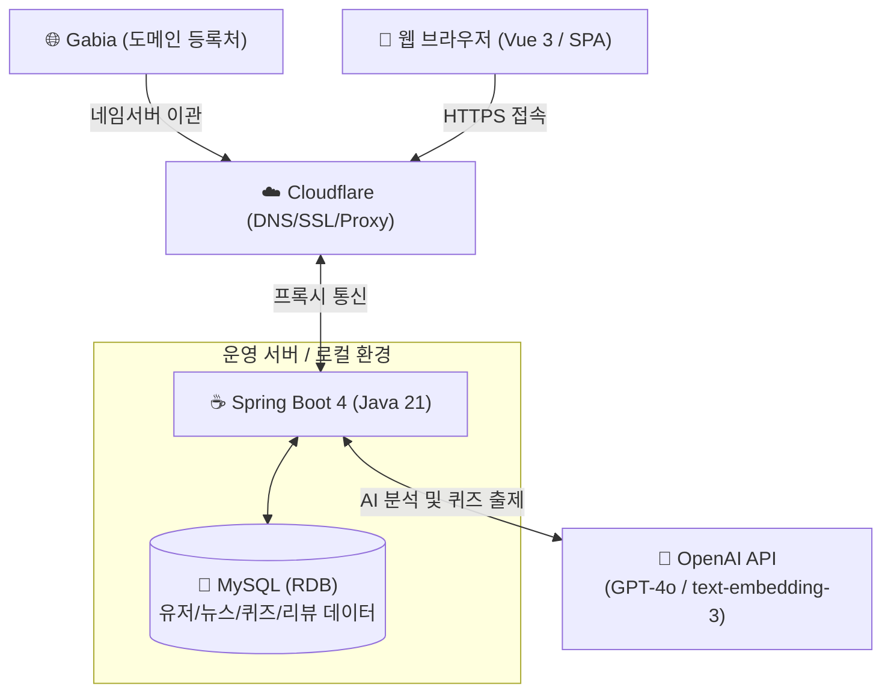

# 📌 뉴센스 (NewSense)
> **청년층과 학생의 금융·경제 문해력 향상을 위한 뉴스 기반 자기주도 학습 플랫폼**

<p align="center">
  
  
  
  
  
</p>

---

## 💡 서비스 소개
**뉴센스(NewSense)**는 실생활 경제 뉴스를 학습 교재로 활용하여, 청년층과 학생들이 어려운 경제 지식을 자기주도적으로 학습하고 문해력을 기를 수 있도록 돕는 서비스입니다. 

단순히 경제 뉴스를 나열하는 것을 넘어, **뉴스 속 경제 개념 학습 ➔ 이해도 진단(퀴즈) ➔ 자기주도 요약 및 리뷰 ➔ AI 오답노트**로 이어지는 유기적인 학습 순환 고리를 제공합니다.

---

## 🛠️ 핵심 기능

* **뉴스 기반 경제 학습 흐름**: 
  * 수준 및 관심 주제별 경제 뉴스 추천 피드 제공.
  * 기사 본문 속 어려운 용어를 하이라이트하고 클릭 시 쉬운 설명 제공.
* **이해도 진단 (AI 기반 퀴즈)**:
  * 기재부 경제 용어 사전 및 AI를 활용해 해당 기사 맥락에 맞는 객관식/단답형 퀴즈 자동 출제.
* **자기주도 리뷰 & AI 피드백**:
  * 읽은 뉴스를 자신만의 언어로 요약/정리하고, AI가 작성 내용을 분석하여 개념 정합성 피드백 제공.
* **성장 관리 및 오답노트**:
  * 틀린 퀴즈 문제 및 오답 원인을 파악할 수 있는 자동 오답노트 기능.
  * 일 단위 학습을 추적하는 학습 캘린더와 취약 도메인 개념 시각화 통계 제공.

---

## 🏗️ 시스템 아키텍처 및 데이터 흐름

뉴센스는 가비아(Gabia) 도메인을 클라우드플레어(Cloudflare) 네임서버로 이관하여 안전한 HTTPS 보안 프로토콜 및 DNS 프록시를 적용하고, 백엔드는 Spring Boot 4, 데이터베이스는 MySQL을 주 저장소로 채택하여 신뢰성 있고 안정적인 서비스를 제공합니다.



> [!NOTE]
> * **Cloudflare**: 가비아 도메인의 네임서버를 이관받아 SSL/TLS 암호화(HTTPS)를 제공하며, 악성 트래픽 방어 및 캐싱을 지원합니다.
> * **MySQL**: 회원 정보, 학습한 뉴스 본문, 생성된 퀴즈, 사용자 리뷰 및 오답 노트 등 모든 비즈니스 도메인 데이터를 관계형 데이터베이스로 관리합니다.

---

## 📂 프로젝트 폴더 구조

```text
newsense/
├── backend/                  # Spring Boot 4 + Java 21 백엔드 프로젝트
│   ├── src/                  # 백엔드 소스 코드
│   └── build.gradle          # 백엔드 의존성 및 빌드 설정
├── frontend/                 # Vue 3 + Vite 프론트엔드 프로젝트
│   ├── src/                  # 프론트엔드 컴포넌트 및 앱 소스 코드
│   └── package.json          # 프론트엔드 의존성 설정
├── .gitignore                # 모노레포 관리 통합 Git Ignore
└── README.md                 # 프로젝트 통합 가이드 (본 문서)
```

---

## 🚀 로컬 실행 방법

### 1. 데이터베이스 준비
로컬 환경에 MySQL 서버를 실행하고, 본 애플리케이션에서 사용할 `newsense` 데이터베이스를 생성해 줍니다.
```sql
CREATE DATABASE newsense CHARACTER SET utf8mb4 COLLATE utf8mb4_unicode_ci;
```

### 2. 백엔드 실행 (Spring Boot)
```bash
cd backend
# Gradle 의존성 빌드 및 구동 (Java 21 필요)
./gradlew bootRun
```
* **API base URL**: `http://localhost:8080`

### 3. 프론트엔드 실행 (Vue 3)
```bash
cd frontend
# 의존성 패키지 설치
npm install

# 로컬 개발 서버 기동
npm run dev
```
* **로컬 웹 주소**: `http://localhost:5173`

---

## 🎨 Git 커밋 메시지 컨벤션 (Gitmoji)

뉴센스 프로젝트는 작업의 직관성을 높이기 위해 **깃모지(Gitmoji)** 기반의 커밋 메시지 컨벤션을 따릅니다.

### 📝 메시지 작성 기본 규격
```text
:gitmoji: subject (#이슈번호)

body (선택 - 변경 이유나 상세 내용)
```
*예시: `✨ 퀴즈 결과 저장 API 구현 (#42)`*

### 📌 주요 Gitmoji 목록

| Gitmoji | 코드 명명 | 용도 및 설명 |
| :---: | :--- | :--- |
| ✨ | `:sparkles:` | 새로운 기능 개발 및 추가 (feat) |
| 🐛 | `:bug:` | 버그 현상 수정 및 해결 (fix) |
| 📝 | `:memo:` | 문서 추가 및 수정 (README, 주석, 위키 등) |
| 💄 | `:lipstick:` | UI 레이아웃, 스타일, CSS 코드 수정 (style) |
| ♻️ | `:recycle:` | 비즈니스 로직 리팩토링 (refactor) |
| ✅ | `:white_check_mark:` | 테스트 코드 작성 및 수정 (test) |
| 🔧 | `:wrench:` | 빌드 설정 파일, 의존성 설정 파일 추가/수정 (chore) |
| ⚡️ | `:zap:` | 성능 개선 및 최적화 진행 (perf) |
| 💚 | `:green_heart:` | CI/CD 파이프라인 빌드/배포 설정 변경 |
| ⏪️ | `:rewind:` | 이전 커밋 및 작업 내�