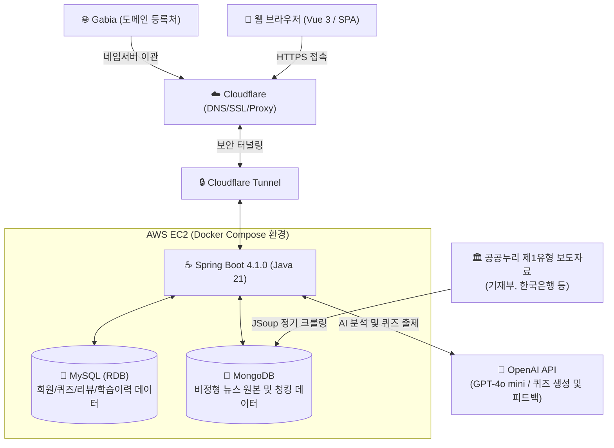

# 📌 뉴센스 (Newsense)
> **청년층과 학생의 금융·경제 문해력 향상을 위한 뉴스 기반 자기주도 경제 학습 플랫폼**

<p align="center">
  
  
  
  
  
  
  
</p>

---

## 💡 서비스 소개
**뉴센스(Newsense)**는 실생활 경제 뉴스를 핵심 학습 재료로 삼아, 금융·경제 개념이 충분히 형성되지 않은 **10대 후반 ~ 20대 초반 학습자(중고생, 대학생, 청년층)**가 자기주도적으로 어려운 경제 지식을 학습하고 문해력을 기를 수 있도록 돕는 서비스입니다.

단순히 경제 뉴스를 요약해서 소비하는 것에 의존하지 않고, **뉴스 속 핵심 경제 개념 학습 ➔ 이해도 진단(퀴즈) ➔ 자기주도 요약 및 리뷰 ➔ 취약 개념 분석 및 AI 오답노트**로 이어지는 유기적인 학습 순환 고리를 설계하여, 비판적 정보 소비 역량을 기르고 지속적으로 복습을 할 수 있도록 지원합니다.

---

## 🛠️ 핵심 기능 및 MVP 범위

### 1. MVP (초기 검증 범위)
* **경제 뉴스 목록 제공**: 카테고리별 뉴스 목록 정렬 기능 및 수준별 학습을 돕기 위한 뉴스 난이도(쉬움, 보통, 어려움 등) 표시.
* **기사 기반 경제 용어 설명**: 기사 속 핵심 용어 자동 추출 및 기획재정부 경제 용어 사전 데이터를 연동한 단어 뜻 풀이 제공.
* **OX·객관식 퀴즈**: 뉴스를 다 읽은 후 맥락에 맞춘 이해도 진단 퀴즈 제공 (정답 및 해설 제공).
* **자기주도 리뷰 작성**: 읽은 뉴스를 자신만의 표현으로 직접 요약하고, 새롭게 알게 된 점과 이해하기 어려웠던 용어 기록.
* **기본 학습 이력**: 학습자가 읽은 뉴스, 완료한 퀴즈, 남긴 리뷰 등 모든 학습 성과를 누적하여 성장 관리 데이터 제공.
* **오답노트**: 틀린 퀴즈 문제를 자동으로 분류하고 수집하여 취약한 개념을 빠르게 파악하고 반복 학습할 수 있도록 지원.

### 2. 2차 및 확장 기능 (로드맵)
* **취약 개념 분석 및 RAG 추천**: 자주 틀린 경제 카테고리/용어를 시각화하고, 기사 청크 검색 기반 보완 뉴스 추천 피드 제공.
* **수준별 설명 확장**: 초급, 중급 등 학습자의 수준에 맞춘 다층형 경제 용어 설명 제공.
* **AI 기반 요약 보조 및 리뷰 피드백**: 학습자가 작성한 요약 리뷰와 기사 원문의 유사도를 비교 판별하여 정합성 코멘트 제공.
* **기관 관리자 페이지**: 교사 및 교육기관용 대시보드를 제공하여 학생별 학습 현황 및 과제 출제 기능 연동.

---

## 🏗️ 시스템 아키텍처 및 데이터 흐름

외부 도메인은 **Cloudflare 네임서버 및 SSL/TLS 암호화(HTTPS)**를 거쳐 안전하게 유입되며, 모든 웹 트래픽은 **Cloudflare Tunnel**을 통해 외부 호스트 포트를 원천 차단하고 격리된 도커(Docker) 컨테이너 네트워크로 유입됩니다.



### 🔒 데이터 흐름 및 보안 격리 프로세스
> [!NOTE]
> * **데이터 수집**: 기획재정부, 한국은행 등 공공누리 제1유형 보도자료 전문을 JSoup으로 정기 크롤링하여 **MongoDB**에 적재함으로써 저작권 분쟁 소지를 사전에 전면 차단합니다.
> * **메인 RDB**: 회원 정보, 학습한 뉴스 매핑 데이터, 생성된 퀴즈 정보, 사용자 리뷰 및 오답 노트 등 비즈니스 도메인의 핵심 관계형 데이터는 **MySQL**에서 트랜잭션을 적용해 신뢰성 있게 관리합니다.
> * **AI 분석 및 퀴즈 출제**: 사용자가 뉴스를 다 읽은 후 이해도를 진단하기 위해, 기사 본문과 용어 정보를 기반으로 **OpenAI GPT-4o mini**를 연동하여 기사 맥락에 맞춘 OX/객관식 퀴즈를 실시간으로 출제하고 리뷰에 대한 피드백을 생성합니다.
> * **네트워크 보안 격리**: AWS EC2 Docker 환경 내부에서 MySQL과 MongoDB의 외부 호스트 포트 바인딩(Expose)을 배제하여 내부 로컬에서만 통신하도록 격리합니다. 인바운드 트래픽은 오직 Cloudflare Tunnel(SSL)을 통한 특정 웹 포트만 수신하도록 제어하여 DB 스캔 등 외부 사이버 공격을 차단합니다.

---

## 📂 프로젝트 폴더 구조
본 프로젝트는 단일 Git 저장소에서 백엔드와 프론트엔드를 통합하여 관리하는 구조입니다.

```text
newsense/
├── backend/                  # Spring Boot 4.1.0 + Java 21 백엔드 프로젝트
│   ├── Dockerfile            # 백엔드 컨테이너 멀티 스테이지 빌드 설정
│   ├── src/                  # 백엔드 소스 코드 (Spring Data JPA, MongoDB)
│   └── build.gradle          # Gradle 의존성 및 빌드 설정
├── docs/                     # 운영 및 실행 문서
├── frontend/                 # Vue 3 + Vite + Pinia + Tailwind CSS 프론트엔드 프로젝트
│   ├── src/                  # 프론트엔드 컴포넌트, 스토어, 라우터 소스 코드
│   └── package.json          # 프론트엔드 npm 패키지 의존성 설정
├── infra/                    # Nginx 등 배포 인프라 설정
├── docker-compose.yml        # 백엔드, DB, 캐시, Nginx 통합 실행 구성
├── .env.example              # Docker Compose 환경변수 예시
├── .gitignore                # Git 제외 대상 설정 파일
└── README.md                 # 프로젝트 통합 가이드 (본 문서)
```

---

## 🚀 로컬 실행 방법

### 0. Docker Compose 통합 실행
백엔드 애플리케이션, MySQL 8.0, MongoDB, Redis, Nginx를 한 번에 실행할 수 있습니다.

```bash
cp .env.example .env
docker compose up -d --build
```

* **Nginx 진입 주소**: `http://127.0.0.1:8080`
* **헬스 체크**: `http://127.0.0.1:8080/api/v1/health`
* MySQL, MongoDB, Redis는 외부 호스트 포트에 바인딩하지 않고 Compose 내부 네트워크에서만 접근합니다.
* 상세 절차는 [`docs/docker-compose.md`](docs/docker-compose.md)를 참고합니다.

### RAG 검색 및 추천 API

MongoDB에 저장된 기사 청크와 MySQL 오답노트 신호를 활용한 1차 RAG 기능을 제공합니다.

* **기사 청크 검색**: `GET /api/v1/rag/search?query=금리&limit=5`
* **내 취약 개념 기반 추천**: `GET /api/v1/rag/recommendations?limit=5` (Bearer 토큰 필요)
* 상세 구조는 [`docs/rag.md`](docs/rag.md)를 참고합니다.

### 1. 데이터베이스 준비
로컬 환경에 **MySQL 8.0** 및 **MongoDB** 인프라가 실행 중이어야 합니다.
* **MySQL 데이터베이스 생성**:
  ```sql
  CREATE DATABASE newsense CHARACTER SET utf8mb4 COLLATE utf8mb4_unicode_ci;
  ```
* **MongoDB**: `newsense` 데이터베이스 생성 후 기사 적재용 컬렉션을 준비합니다.

### 2. 백엔드 실행 (Spring Boot 4.1.0)
로컬에 **Java 21 JDK**가 설치되어 있어야 합니다.
```bash
cd backend
# Gradle 의존성 빌드 및 구동
./gradlew bootRun
```
* **백엔드 API 주소**: `http://localhost:8080`

### 3. 프론트엔드 실행 (Vue 3)
로컬에 **Node.js LTS** 버전이 설치되어 있어야 합니다.
```bash
cd frontend
# 의존성 패키지 설치
npm install

# 로컬 개발 서버 구동 (Vite)
npm run dev
```
* **로컬 웹 주소**: `http://localhost:5173`

---

## 🎨 개발 및 협업 컨벤션

### 1. Git 브랜치 전략 (Git Flow)
1인 프로젝트와 AI 협업 프로세스에 맞춰 단순하고 엄격한 흐름을 적용합니다.
* **`main`**: 프로덕션 배포 전용 최종 안정 브랜치 (직접 push 금지, develop PR을 통해서만 병합)
* **`develop`**: 개발 통합 브랜치 (기능 구현을 완료한 feature/* 브랜치들이 모이는 공간)
* **`feature/*`**: 기능 단위 분기 브랜치 (브랜치 포맷: `feature/기능명` 또는 `feature/issue-번호`)

### 2. Git 커밋 메시지 컨벤션 (Gitmoji)
작업의 의도와 직관성을 강화하기 위해 **깃모지(Gitmoji)** 및 메시지 타입을 지정하여 커밋을 작성합니다.

#### 📝 작성 기본 형식
```plain text
:gitmoji: type : subject (#이슈번호)

body (선택 - 변경 이유나 상세 내용)
```
*예시: `✨ feat : 퀴즈 결과 저장 API 구현 (#12)`*

#### 📌 주요 Gitmoji 목록
| Gitmoji | 코드 명명 | 용도 및 설명 |
| :---: | :--- | :--- |
| ✨ | `:sparkles:` | 새로운 기능 추가 (feat) |
| 🐛 | `:bug:` | 버그 수정 (fix) |
| 📝 | `:memo:` | 문서 추가 및 수정 (docs, README, 주석) |
| 💄 | `:lipstick:` | UI 레이아웃, 스타일, CSS 수정 (style) |
| ♻️ | `:recycle:` | 비즈니스 로직 리팩토링 (refactor) |
| ✅ | `:white_check_mark:` | 테스트 코드 작성 및 수정 (test) |
| 🔧 | `:wrench:` | 빌드 설정, 의존성 패키지 설정 추가/수정 (chore) |
| ⚡️ | `:zap:` | 성능 개선 및 최적화 진행 (perf) |
| 💚 | `:green_heart:` | CI/CD 파이프라인 빌드/배포 설정 변경 (ci) |
| ⏪️ | `:rewind:` | 작업 내용 롤백/되돌리기 (revert) |

### 3. PR(Merge Request) 규칙 및 템플릿
* 모든 작업은 GitLab/GitHub 이슈를 생성한 뒤 분기하여 진행합니다.
* 변경 라인은 가급적 300줄 이하를 지향하며, CI 파이프라인 빌드 및 테스트 통과가 병합의 전제조건입니다.
* PR 작성 시 아래 템플릿 양식을 준수합니다.
```markdown
## 📌 작업 내용
<!-- 이번 PR에서 작업한 내용을 간단히 작성해주세요. -->

## ✅ 변경 사항
- [ ] TODO 1
- [ ] TODO 2
```

---

## ☕ Java / Spring Boot 코드 규칙
* **클래스 네이밍**: `PascalCase` 사용 (예: `QuizResultService`, `ArticleMetaRepository`)
* **메서드 및 변수**: `camelCase` 사용 (예: `findByUserIdAndQuizId()`, `totalScore`)
* **상수**: `UPPER_SNAKE_CASE` 사용 (예: `MAX_RETRY_COUNT`)
* **레이어드 아키텍처**:
  - `Controller`: 요청/응답 관리 및 데이터 바인딩만 수행 (비즈니스 로직 철저히 배제)
  - `Service`: 핵심 비즈니스 연산 및 `@Transactional` 원자성 관리
  - `Repository`: 데이터베이스 물리적 접근 (Spring Data JPA 인터페이스)
* **API 공통 응답 구조**: 모든 응답은 `ApiResponse<T>` 형태의 고정 래퍼 규격을 준수합니다.
```json
{
  "success": true,
  "code": 200,
  "message": "퀴즈 결과 조회 성공",
  "data": {
    "quizResultId": 12,
    "isCorrect": true
  }
}
```

---

## 🎨 Vue 3 / Frontend 코드 규칙
* **컴포넌트 파일 네이밍**: `PascalCase` 명명법을 따릅니다 (예: `QuizCard.vue`, `ArticleFeedList.vue`).
* **페이지 뷰 컴포넌트**: `PascalCase`와 함께 `View` 접미사를 붙여 구분합니다 (예: `HomeView.vue`, `QuizResultView.vue`).
* **컴포넌트 작성 API**: Composition API (`<script setup>`) 방식을 필수로 차용합니다.
* **상태 관리**: 스토어 파일은 `camelCase`로 설계하고 `use` 접두사를 붙여 Pinia를 활용합니다 (예: `useUserStore.js`, `useQuizStore.js`).
* **UI 마크업**: ad-hoc 스타일링을 피하고 테일윈드(Tailwind CSS)를 이용한 유틸리티 중심 반응형 구현을 준수합니다.
