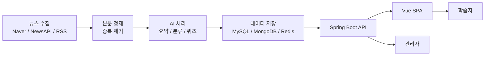

# Newsense

> AI 요약, 퀴즈, 학습 이력으로 경제 뉴스를 학습 콘텐츠로 바꾸는 금융·경제 문해력 플랫폼

<p align="center">
  <a href="https://sonarcloud.io/summary/new_code?id=Sungw0o_Newsense">
    
  </a>
  <a href="https://sonarcloud.io/summary/new_code?id=Sungw0o_Newsense">
    
  </a>
  <a href="https://sonarcloud.io/summary/new_code?id=Sungw0o_Newsense">
    
  </a>
</p>

## 서비스 소개

**Newsense**는 청년층과 학생이 경제 뉴스를 읽으며 핵심 개념을 익히고, AI 퀴즈와 오답노트로 이해도를 점검할 수 있는 자기주도 경제 학습 서비스입니다.

뉴스 수집부터 본문 정제, AI 요약, 카테고리 분류, 퀴즈 생성, 학습 이력 기록까지 하나의 흐름으로 연결해 경제 문해력 학습 경험을 제공합니다.

## 주요 기능

| 기능 | 설명 |
| --- | --- |
| 뉴스 피드 | 경제 기사 목록, 검색, 카테고리 필터, 최신 업데이트 정보 제공 |
| AI 요약 | 기사 본문 기반 3줄 요약 및 관리자 수동 요약 생성 지원 |
| AI 퀴즈 | 기사 내용과 경제 개념을 바탕으로 OX/객관식 퀴즈 생성 |
| RAG 검색 | 기사 청크와 경제 용어 기반 검색 및 추천 |
| 학습 이력 | 읽기 완료, 퀴즈 풀이, 리뷰 작성 기록 관리 |
| 오답노트 | 틀린 문제와 취약 개념을 누적해 복습 흐름 제공 |
| 커뮤니티 | 경제 이슈 게시글, 댓글, 좋아요 기능 제공 |
| 소셜 로그인 | Google, Naver, Kakao OAuth2 로그인과 JWT 인증 연동 |
| 관리자 기능 | 기사 관리, AI 요약 상태 모니터링, 권한 기반 접근 제어 |

## 기술 스택

| 구분 | 스택 |
| --- | --- |
| 언어 |   |
| 프레임워크 |      |
| DB |    |
| 기타 API |     |

## 시스템 흐름



## 프로젝트 구조

```text
newsense/
├── backend/                 # Spring Boot API, AI, OAuth2, 크롤러, 학습 도메인
├── frontend/                # Vue 3 SPA, Pinia store, 화면 컴포넌트
├── infra/nginx/             # EC2 Docker Compose용 Nginx 프록시 설정
├── docs/                    # 실행, 배포, AI/RAG 운영 문서
├── docker-compose.yml       # 백엔드 운영 컨테이너 구성
└── .env.example             # Docker Compose 환경변수 예시
```

## 문서

| 문서 | 내용 |
| --- | --- |
| [실행 가이드](docs/run-guide.md) | 로컬, Docker Compose, 프론트엔드 실행 방법 |
| [배포 환경변수](docs/deployment-secrets.md) | GitHub Secrets/Variables와 EC2 `.env` 관리 |
| [Docker Compose](docs/docker-compose.md) | Compose 기반 백엔드 실행 및 운영 |
| [AI 파이프라인 전략](docs/ai-pipeline-strategy.md) | 비용 효율형 멀티 모델 요약/퀴즈 전략 |
| [RAG 문서](docs/rag.md) | 기사 청크 검색과 추천 구조 |

## API 문서

로컬 백엔드 실행 후 Swagger UI에서 전체 API를 확인할 수 있습니다.

[http://localhost:8080/swagger-ui/index.html](http://localhost:8080/swagger-ui/index.html)
