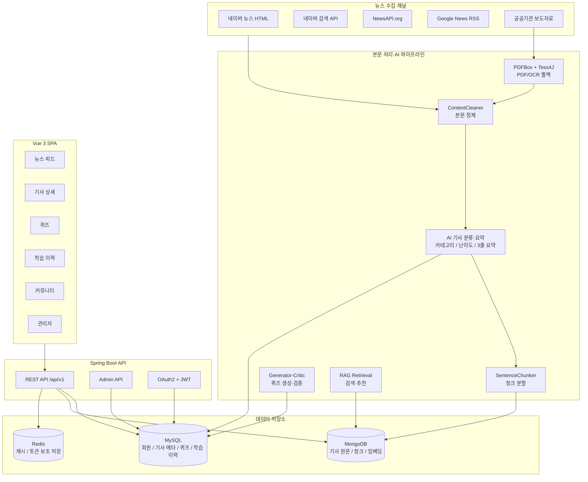

# Newsense

> 청년층과 학생의 금융·경제 문해력 향상을 위한 뉴스 기반 자기주도 경제 학습 플랫폼

<p align="center">
  <a href="https://sonarcloud.io/summary/new_code?id=Sungw0o_Newsense">
    
  </a>
  <a href="https://sonarcloud.io/summary/new_code?id=Sungw0o_Newsense">
    
  </a>
  <a href="https://sonarcloud.io/summary/new_code?id=Sungw0o_Newsense">
    
  </a>
  <a href="https://sonarcloud.io/summary/new_code?id=Sungw0o_Newsense">
    
  </a>
  <a href="https://sonarcloud.io/summary/new_code?id=Sungw0o_Newsense">
    
  </a>
</p>

## 서비스 소개

**Newsense**는 실생활 경제 뉴스를 핵심 학습 재료로 삼아, 금융·경제 개념이 충분히 형성되지 않은 10대 후반부터 20대 초반 학습자가 자기주도적으로 경제 지식을 학습하고 문해력을 기를 수 있도록 돕는 서비스입니다.

뉴스 수집 → 본문 정제 → AI 요약·분류·퀴즈 생성 → RAG 기반 경제 용어 검색·맞춤 기사 추천 → 퀴즈 풀이 → 오답노트·취약 개념 분석 → 학습 이력 복습까지 하나의 학습 루프로 연결합니다.

## 현재 배포 구성

| 영역 | 구성 |
| --- | --- |
| 프론트엔드 | S3 + CloudFront 기반 Vue 3 SPA |
| 백엔드 | EC2 + Docker Compose 기반 Spring Boot API |
| 데이터 저장소 | MySQL 8, MongoDB 7, Redis 7 |
| 운영 도메인 | `new5ense.site` 프론트, `api.new5ense.site` 백엔드 API |
| 품질 관리 | GitHub Actions + JaCoCo + SonarCloud |

## 주요 기능

| 기능 | 설명 |
| --- | --- |
| 다채널 뉴스 수집 | 네이버 뉴스, 네이버 검색 API, NewsAPI, Google News RSS 중심의 경제 기사 수집 |
| PDF/OCR 처리 | PDFBox 1차 텍스트 추출, Tess4J OCR 폴백으로 공공기관 PDF 본문 처리 |
| AI 3줄 요약 | 본문 핵심 수치와 인과관계를 포함한 정보 밀도 높은 요약 생성 |
| AI 퀴즈 | 개념 이해, 사실 확인, 인과 추론 3단계 OX·객관식 퀴즈 자동 생성 |
| Generator-Critic 검증 | 생성된 퀴즈의 정답, 근거, 선택지 품질을 검증하고 필요 시 재출제 |
| RAG 검색·추천 | 기사 청크와 경제 용어 기반 검색, 취약 개념 기반 맞춤 기사 추천 |
| 학습 이력 | 읽기 완료, 퀴즈 풀이, 리뷰 작성 이력을 분류별 접기/펼치기 형태로 제공 |
| 오답노트 | 틀린 문제와 취약 경제 용어를 누적하고 복습 흐름 제공 |
| 연관 기업 정보 | 기사에서 추출한 관련 종목의 현재가, 등락률, 거래량 표시 및 API 실패 시 fallback 제공 |
| 커뮤니티 | 경제 이슈 게시글, 댓글, 좋아요, 신고 접수 흐름 제공 |
| 소셜 로그인 | Google, Naver, Kakao OAuth2와 JWT Access/HttpOnly Refresh Cookie 통합 |
| 관리자 | 기사 수집·요약 관리, 기사 삭제·페이징, 회원 권한·탈퇴 처리, 신고·문의 관리 |
| 경제 지표 | 홈 사이드 패널에 주요 금융 지표와 현재 기준 시간 표시 |

## 뉴스 수집 파이프라인

| 채널 유형 | 구현 | 수집 대상 |
| --- | --- | --- |
| 포털 HTML 크롤링 | `NaverNewsCrawler` | 네이버 경제 섹션 및 인기 기사 |
| 포털 검색 API | `NaverSearchNewsApiCollector` | 경제·금융·투자·정책·산업 키워드 검색 결과 |
| 글로벌 뉴스 API | `NewsApiCollector` | 한국 비즈니스 헤드라인 |
| RSS | `GoogleNewsRssCollector` | 경제·금융·투자 키워드 RSS 피드 |
| 공공기관 크롤링 | `PublicNewsCrawlerClient` | 한국은행, 기획재정부 보도자료 수집 구조 지원 |

수집된 기사는 SHA-256 해시 기반 중복 검사를 거치고, MongoDB에는 원문·청크를, MySQL에는 기사 메타·요약·퀴즈·학습 데이터를 저장합니다.

## 시스템 아키텍처



## AI 파이프라인

| 단계 | 역할 |
| --- | --- |
| 본문 정제 | HTML, 기자 이메일, 저작권 문구, 반복 서명 제거 |
| 팩트 추출 | 기사 본문의 수치, 기관명, 핵심 이벤트 정리 |
| 요약·분류 | 5대 경제 카테고리, 난이도, 3줄 요약, 관련 종목 추출 |
| 퀴즈 생성 | OX 1문항, 객관식 2문항을 개념·사실·인과 추론으로 구성 |
| Critic 검증 | 정답 중복, 기사 근거, 선택지 품질을 검토하고 필요 시 재출제 |
| RAG 추천 | 오답노트의 취약 용어를 기반으로 관련 기사 추천 |

자세한 모델·비용 전략은 [`docs/ai-pipeline-strategy.md`](docs/ai-pipeline-strategy.md)를 참고하세요.

## 기술 스택

| 구분 | 스택 |
| --- | --- |
| 언어 |   |
| 프레임워크 |      |
| DB |    |
| AI/API |      |
| Infra/Quality |       |

## 프로젝트 구조

```text
Newsense/
├── 02_SpringBoot/                      # Spring Boot 백엔드
│   └── src/main/java/com/newsense/backend/
│       ├── ai/                   # 기사 분류·요약·퀴즈 AI 클라이언트
│       ├── article/              # 기사 도메인, 크롤러, 상세/피드 API
│       ├── auth/                 # OAuth2, JWT, Security
│       ├── community/            # 게시글, 댓글, 반응, 신고
│       ├── indicator/            # 금융 지표
│       ├── learning/             # 학습 이력
│       ├── quiz/                 # 퀴즈 도메인·채점
│       ├── rag/                  # 검색·추천
│       ├── stock/                # 연관 종목 시세
│       ├── user/                 # 회원·프로필
│       └── wrongnote/            # 오답노트
├── 03_Vue/                       # Vue 3 + Vite + Pinia
│   └── src/
│       ├── api/                  # Axios API 클라이언트
│       ├── components/           # 공통·기사·홈 컴포넌트
│       ├── stores/               # Pinia 상태 관리
│       └── views/                # 화면 단위 컴포넌트
├── 01_DB/                        # 전체 MySQL DDL 스키마
├── 04_Dataset/                   # 프롬프트 계약 기반 데모/fallback 데이터셋
├── docs/                         # 실행·배포·RAG·인프라 문서
├── infra/                        # Nginx 등 인프라 설정
└── docker-compose.yml            # EC2 백엔드/DB 운영 Compose
```

## 실행 및 운영 문서

| 문서 | 내용 |
| --- | --- |
| [`docs/run-guide.md`](docs/run-guide.md) | 로컬 실행, Docker Compose, 배포 메모 |
| [`docs/docker-compose.md`](docs/docker-compose.md) | 백엔드·DB·Redis·Nginx Compose 실행 |
| [`docs/deployment-secrets.md`](docs/deployment-secrets.md) | GitHub Secrets, EC2 `.env`, SonarCloud 설정 |
| [`docs/rag.md`](docs/rag.md) | RAG 검색 구조 |
| [`02_SpringBoot/RUN.md`](02_SpringBoot/RUN.md) | 백엔드 실행 및 seed 참고 |
| [`03_Vue/RUN.md`](03_Vue/RUN.md) | 프론트엔드 실행 참고 |

## 빠른 실행

```bash
# backend
cd 02_SpringBoot
./gradlew bootRun --args='--spring.profiles.active=local'
```

```bash
# frontend
cd 03_Vue
npm install
npm run dev
```

통합 실행과 운영 배포 절차는 [`docs/run-guide.md`](docs/run-guide.md)를 기준으로 관리합니다.
