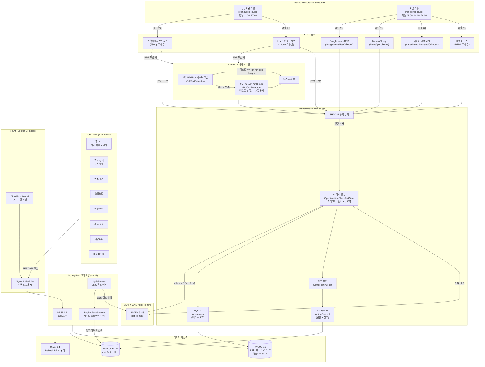

# 📌 뉴센스 (Newsense)
> **청년층과 학생의 금융·경제 문해력 향상을 위한 뉴스 기반 자기주도 경제 학습 플랫폼**

<p align="center">
  
  
  
  
  
  
  
</p>

---

## 서비스 소개

**뉴센스(Newsense)**는 실생활 경제 뉴스를 핵심 학습 재료로 삼아, 금융·경제 개념이 충분히 형성되지 않은 **10대 후반 ~ 20대 초반 학습자(중고생, 대학생, 청년층)**가 자기주도적으로 경제 지식을 학습하고 문해력을 기를 수 있도록 돕는 서비스입니다.

단순히 경제 뉴스를 요약해서 소비하는 것에 의존하지 않고, **뉴스 속 핵심 경제 개념 학습 → 이해도 진단(퀴즈) → 자기주도 요약 리뷰 → 오답노트·취약 개념 분석**으로 이어지는 유기적인 학습 순환 고리를 설계하여 지속적인 복습을 지원합니다.

---

## 주요 기능

### 1. 다채널 경제 뉴스 자동 수집 파이프라인

실제 구현된 수집 채널은 **공공기관 채널 2개**와 **포털/글로벌 채널 4개**로 구성됩니다.

| 채널 유형 | 클래스 | 수집 대상 |
|---|---|---|
| 공공기관 (JSoup 크롤링) | `PublicNewsCrawlerClient` | 한국은행 (BOK), 기획재정부 (MOEF) |
| 네이버 뉴스 (HTML 크롤링) | `NaverNewsCrawler` | 네이버 경제 섹션 및 인기 기사 |
| 네이버 검색 API | `NaverSearchNewsApiCollector` | 경제·금융·투자·정책·산업 키워드 검색 결과 |
| NewsAPI.org | `NewsApiCollector` | 한국 비즈니스 헤드라인 |
| Google News RSS | `GoogleNewsRssCollector` | 경제·금융·투자 키워드 RSS 피드 |

- 공공기관 채널은 PDF 첨부파일을 자동 감지하여 PDF OCR 파이프라인을 거쳐 본문을 추출합니다.
- 수집된 기사는 SHA-256 해시 기반 중복 검사를 통해 동일 기사의 중복 저장을 방지합니다.

### 2. PDF OCR 이중화 파이프라인

공공기관 보도자료는 종종 스캔 PDF 형태로 제공됩니다. 이를 처리하기 위해 두 단계 파이프라인을 구성합니다.

- **1차 텍스트 추출**: `PdfTextExtractor` (Apache PDFBox 3.0.1) — 텍스트 레이어가 있는 PDF에서 직접 텍스트를 추출합니다.
- **2차 OCR 추출**: `PdfOcrExtractor` (Tess4J 5.8.0 / Tesseract) — 1차 추출 텍스트가 `crawler.pdf-min-text-length` 기준(기본 500자)에 미달하면 PDF 페이지를 250 DPI 이미지로 렌더링하여 한국어 OCR을 수행합니다.

### 3. AI 기사 분류 및 퀴즈 자동 생성

**기사 분류** (`OpenAiArticleClassifierClient`): 수집된 기사를 저장할 때 SSAFY GMS(gpt-4o-mini)를 사용하여 카테고리(거시경제 / 금융·투자 / 정책·제도 / 기업·산업 / 글로벌경제), 난이도(초급 / 중급 / 고급), 3줄 요약을 자동 생성합니다.

**퀴즈 자동 생성** (`OpenAiQuizClient`): 사용자가 기사 퀴즈를 처음 요청할 때(Lazy 방식) SSAFY GMS(gpt-4o-mini)가 기사 본문, RAG 근거 청크, 기재부 경제 용어 사전을 결합하여 OX 1문항 + 객관식 2문항을 생성합니다. 생성된 퀴즈는 MySQL에 저장되고 이후 요청 시 재사용됩니다.

### 4. RAG 기반 기사 검색 및 취약 개념 추천

`RagRetrievalService`는 MongoDB에 저장된 기사 청크를 키워드 스코어링 방식으로 검색합니다.

- **기사 검색**: `GET /api/v1/rag/search?query=금리&limit=5`
- **취약 개념 기반 추천**: `GET /api/v1/rag/recommendations?limit=5` — 사용자의 오답노트에서 취약 경제 용어를 추출하여 관련 기사를 추천합니다.
- **퀴즈 근거 검색**: 퀴즈 생성 시 기사 제목 및 경제 용어 키워드로 청크를 검색하여 증거로 제공합니다.
- `guidelines/importance_criteria.md` 문서는 RAG LLM이 수집 기사의 중요도를 평가하는 기준으로 사용됩니다(70점 이상 = 중요 기사).

### 5. 학습 피드 및 기사 읽기

- 카테고리·난이도 필터, 정렬 기능이 포함된 기사 목록 페이지
- 기사 상세 페이지에서 경제 용어 자동 추출 및 기재부 경제 용어 사전 툴팁 제공
- 기사 읽음 완료 처리(`ArticleReadCompletedEvent`) 및 북마크 기능

### 6. 오답노트 및 학습 이력

- 퀴즈 오답 시 자동으로 `WrongNote` 생성 및 관련 경제 용어 연결
- 학습 이력 타임라인(읽기 완료 / 퀴즈 완료 / 리뷰 작성) 제공
- 일별 학습 통계 및 학습 이력 조회

### 7. 자기주도 리뷰 작성

기사를 읽은 후 자신만의 표현으로 요약 리뷰를 작성하고, 새롭게 알게 된 점과 이해하기 어려웠던 용어를 기록합니다.

### 8. 커뮤니티

사용자 간 경제 이슈 토론 게시판. 게시글 작성, 댓글, 반응(좋아요 등) 기능을 제공합니다.

### 9. 마이페이지 및 계정 관리

프로필(닉네임, 관심사) 수정, 회원 탈퇴(소프트 삭제) 기능을 제공합니다.

---

## 시스템 아키텍처



### 데이터 흐름 요약

> - **수집**: `PublicNewsCrawlerScheduler`가 이원화 크론 스케줄에 따라 공공기관(평일 2회)과 포털(매일 3회)을 각각 수집합니다.
> - **PDF 처리**: 공공기관 보도자료의 PDF 첨부파일을 PDFBox로 1차 추출하고, 텍스트가 부족하면 Tess4J OCR로 2차 추출합니다.
> - **저장**: `ArticlePersistenceService`가 SHA-256 중복 검사 → AI 분류(카테고리/난이도/요약) → 청크 분할 → MongoDB(원문) + MySQL(메타) 이중 저장합니다.
> - **퀴즈**: 사용자가 최초 요청 시 `QuizService`가 RAG 근거 청크와 경제 용어 사전을 조합하여 SSAFY GMS로 퀴즈를 Lazy 생성합니다.
> - **보안**: DB 포트는 외부에 노출하지 않고 Compose 내부 네트워크에서만 통신합니다. 인바운드 트래픽은 Cloudflare Tunnel을 통해서만 수신합니다.

---

## 기술 스택

### 백엔드

| 분류 | 기술 | 버전 |
|---|---|---|
| 언어 / 런타임 | Java | 21 |
| 프레임워크 | Spring Boot | 4.1.0 |
| ORM | Spring Data JPA (Hibernate) | - |
| 문서 DB 클라이언트 | Spring Data MongoDB | - |
| 캐시 클라이언트 | Spring Data Redis | - |
| 보안 | Spring Security + JWT (jjwt 0.13.0) | - |
| HTML 크롤링 | Jsoup | 1.22.2 |
| PDF 텍스트 추출 | Apache PDFBox | 3.0.1 |
| PDF OCR | Tess4J (Tesseract) | 5.8.0 |
| AI (퀴즈/분류) | SSAFY GMS / OpenAI API (gpt-4o-mini) | - |
| API 문서화 | SpringDoc OpenAPI (Swagger UI) | 3.0.3 |
| 빌드 도구 | Gradle | - |
| 테스트 | JUnit 5 + Testcontainers + JaCoCo | - |

### 프론트엔드

| 분류 | 기술 | 비고 |
|---|---|---|
| 프레임워크 | Vue 3 | Composition API (`<script setup>`) |
| 번들러 | Vite | - |
| 상태 관리 | Pinia | - |
| HTTP 클라이언트 | Axios | - |
| CSS | Tailwind CSS | 유틸리티 중심 반응형 |
| 라우팅 | Vue Router | - |

### 인프라

| 분류 | 기술 | 버전 |
|---|---|---|
| 컨테이너 오케스트레이션 | Docker Compose | - |
| 웹 서버 / 리버스 프록시 | Nginx | 1.27-alpine |
| 관계형 DB | MySQL | 8.0 |
| 문서 DB | MongoDB | 7.0 |
| 인메모리 캐시 | Redis | 7.4-alpine |
| DNS / SSL | Cloudflare (Tunnel + 네임서버) | - |
| 클라우드 | AWS EC2 | - |

---

## 프로젝트 구조

```text
newsense/
├── backend/                          # Spring Boot 4.1.0 + Java 21 백엔드
│   ├── Dockerfile
│   ├── build.gradle
│   └── src/main/java/com/newsense/backend/
│       ├── ai/                       # AI 클라이언트 (OpenAI 기사 분류 / 퀴즈 생성)
│       │   ├── article/              # OpenAiArticleClassifierClient
│       │   ├── quiz/                 # OpenAiQuizClient, GeneratedQuiz
│       │   └── config/               # OpenAiProperties
│       ├── article/                  # 기사 도메인
│       │   ├── controller/           # ArticleFeedController, ArticleDetailController
│       │   ├── crawler/              # 수집 파이프라인 전체
│       │   │   ├── client/           # 5개 채널 수집 클라이언트
│       │   │   ├── config/           # CrawlerProperties, CrawlerConfig
│       │   │   ├── scheduler/        # PublicNewsCrawlerScheduler
│       │   │   ├── service/          # PublicNewsCrawlerService, PortalNewsCrawlerService
│       │   │   │                     # ArticlePersistenceService, LocalArticleBootstrapRunner
│       │   │   └── util/             # PdfTextExtractor, PdfOcrExtractor, SentenceChunker
│       │   ├── document/             # ArticleContent (MongoDB 도큐먼트)
│       │   ├── domain/               # ArticleMeta (MySQL 엔티티)
│       │   └── service/              # ArticleDetailService
│       ├── auth/                     # 인증·인가 (JWT, Spring Security)
│       ├── bookmark/                 # 북마크 도메인
│       ├── community/                # 커뮤니티 게시판 (Post, Comment, Reaction)
│       ├── learning/                 # 학습 이력 (LearningHistory, LearningHistoryService)
│       ├── quiz/                     # 퀴즈 도메인 (QuizService, QuizController)
│       ├── rag/                      # RAG 검색 (RagRetrievalService, RagController)
│       ├── review/                   # 리뷰 도메인
│       ├── term/                     # 경제 용어 사전 (Term, ArticleTerm)
│       ├── user/                     # 회원 도메인 (UserService, UserController)
│       ├── wrongnote/                # 오답노트 (WrongNoteService, WrongNoteRecorder)
│       └── common/                   # 공통 응답, 예외 처리, 설정
├── frontend/                         # Vue 3 + Vite + Pinia 프론트엔드
│   ├── src/
│   │   ├── api/                      # Axios 기반 API 클라이언트 (articleApi, quizApi 등)
│   │   ├── components/               # 재사용 컴포넌트 (article/, quiz/, common/)
│   │   ├── router/                   # Vue Router 라우트 정의
│   │   ├── stores/                   # Pinia 스토어 (useUserStore, useQuizStore 등)
│   │   └── views/                    # 페이지 컴포넌트 (HomeView, QuizView 등)
│   └── package.json
├── infra/
│   └── nginx/                        # Nginx 리버스 프록시 설정
├── docs/                             # 운영 가이드 문서
├── docker-compose.yml                # 통합 실행 구성
├── .env.example                      # 환경변수 예시
└── README.md
```

---

## 로컬 환경 실행 방법

### 0. 사전 요구사항

| 도구 | 최소 버전 |
|---|---|
| Java JDK | 21 |
| Node.js | LTS (18 이상) |
| Docker Desktop | 최신 권장 |
| Tesseract OCR | 5.x (한국어 `kor.traineddata` 포함) |

### 1. Docker Compose 통합 실행 (권장)

백엔드, MySQL 8.0, MongoDB 7.0, Redis 7.4, Nginx를 한 번에 실행합니다.

```bash
cp .env.example .env
# .env 파일에 필수 환경변수 입력 후
docker compose up -d --build
```

- **Nginx 진입 주소**: `http://127.0.0.1:8080`
- **헬스 체크**: `http://127.0.0.1:8080/api/v1/health`
- MySQL, MongoDB, Redis는 Compose 내부 네트워크에서만 접근합니다.
- 상세 절차: [`docs/docker-compose.md`](docs/docker-compose.md)

### 2. 백엔드 단독 실행

`application-local.yml` 기준으로 로컬 환경에서 실행합니다.

```bash
cd backend
./gradlew bootRun --args='--spring.profiles.active=local'
```

**`application-local.yml` 필수 설정값**:

```yaml
crawler:
  # 크롤러 활성화 여부 (로컬 기본값: false)
  enabled: false

  # 앱 시작 시 최소 기사 수 자동 수집 여부 (로컬 기본값: true)
  bootstrap-enabled: true
  minimum-articles: 30

  # 소스당 최대 수집 건수
  max-items-per-source: 30

  # PDF 1차 추출 최소 텍스트 길이 (미달 시 OCR 폴백)
  pdf-min-text-length: 500

  # Tesseract 한국어 traineddata 경로 (스캔 PDF OCR 필수)
  # 예: /usr/share/tessdata  또는  C:/Program Files/Tesseract-OCR/tessdata
  tess-data-path: ""

  # 네이버 검색 API (https://developers.naver.com)
  naver-client-id: ""
  naver-client-secret: ""

  # NewsAPI.org API Key (https://newsapi.org)
  news-api-key: ""

  # 이원화 크론 스케줄 (기본값)
  cron:
    public-source: "0 0 11,17 * * MON-FRI"   # 공공기관: 평일 11:00, 17:00
    portal-source: "0 0 8,14,20 * * *"        # 포털: 매일 08:00, 14:00, 20:00

openai:
  # SSAFY GMS API Key (기사 분류 및 퀴즈 생성 필수)
  api-key: ""
  base-url: "https://gms.ssafy.io/gmsapi/api.openai.com/v1"
  model: "gpt-4o-mini"

jwt:
  secret: "newsense-local-jwt-secret-key-at-least-32-bytes"
  access-expiration: 1800000    # 30분 (ms)
  refresh-expiration: 1209600000 # 14일 (ms)
```

> **참고**: `tess-data-path`가 비어 있으면 스캔 PDF OCR 기능이 비활성화됩니다. `naver-client-id`, `naver-client-secret`, `news-api-key`가 비어 있으면 해당 채널의 수집이 건너뜁니다.

### 3. 데이터베이스 준비 (개별 실행 시)

```sql
-- MySQL
CREATE DATABASE newsense CHARACTER SET utf8mb4 COLLATE utf8mb4_unicode_ci;
```

MongoDB는 `newsense` 데이터베이스를 자동 생성합니다(`auto-index-creation: true`).

### 4. 프론트엔드 실행

```bash
cd frontend
npm install
npm run dev
# 로컬 개발 서버: http://localhost:5173
```

---

## 이원화 스케줄링 정책

`PublicNewsCrawlerScheduler`는 수집 채널 특성에 따라 두 가지 크론 스케줄을 독립적으로 운영합니다.

| 스케줄 키 | 기본 크론 표현식 | 실행 주기 | 대상 채널 |
|---|---|---|---|
| `crawler.cron.public-source` | `0 0 11,17 * * MON-FRI` | 평일 11:00, 17:00 (1일 2회) | 한국은행, 기획재정부 |
| `crawler.cron.portal-source` | `0 0 8,14,20 * * *` | 매일 08:00, 14:00, 20:00 (1일 3회) | 네이버 뉴스, 네이버 검색 API, NewsAPI.org, Google News RSS |

- **공공기관 채널**은 업무 시간(평일)에만 보도자료를 발행하므로 평일 2회만 수집합니다.
- **포털 채널**은 매일 실시간으로 뉴스가 업데이트되므로 하루 3회 수집합니다.
- 크론 표현식은 환경변수(`SPRING_CRAWLER_CRON_PUBLIC`, `SPRING_CRAWLER_CRON_PORTAL`)로 재정의할 수 있습니다.
- `crawler.enabled: false`로 설정하면 스케줄러 전체가 비활성화됩니다.
- 로컬 환경에서는 `crawler.bootstrap-enabled: true`로 설정하면 앱 시작 시 `LocalArticleBootstrapRunner`가 최소 기사 수(기본 30건)를 자동으로 수집합니다.

---

## API 주요 엔드포인트

| 메서드 | 경로 | 설명 |
|---|---|---|
| GET | `/api/v1/health` | 헬스 체크 |
| POST | `/api/v1/auth/signup` | 회원가입 |
| POST | `/api/v1/auth/login` | 로그인 |
| POST | `/api/v1/auth/logout` | 로그아웃 |
| GET | `/api/v1/articles` | 기사 목록 (필터·페이징) |
| GET | `/api/v1/articles/{id}` | 기사 상세 |
| GET | `/api/v1/articles/{id}/terms` | 기사 경제 용어 |
| POST | `/api/v1/articles/{id}/read` | 기사 읽음 완료 |
| POST | `/api/v1/articles/{id}/bookmark` | 북마크 토글 |
| GET | `/api/v1/articles/{id}/quiz` | 퀴즈 조회 (없으면 자동 생성) |
| POST | `/api/v1/quiz/{id}/answer` | 퀴즈 답안 제출 |
| GET | `/api/v1/wrong-notes` | 오답노트 목록 |
| GET | `/api/v1/learning/history` | 학습 이력 |
| GET | `/api/v1/rag/search` | 기사 키워드 검색 |
| GET | `/api/v1/rag/recommendations` | 취약 개념 기반 기사 추천 |
| GET | `/api/v1/users/me` | 내 프로필 조회 |
| PUT | `/api/v1/users/me` | 프로필 수정 |

전체 API 명세는 `http://localhost:8080/swagger-ui/index.html`에서 확인할 수 있습니다.

---

## 공통 응답 구조

모든 API 응답은 `ApiResponse<T>` 래퍼 형식을 따릅니다.

```json
{
  "success": true,
  "code": 200,
  "message": "퀴즈 결과 조회 성공",
  "data": {
    "quizResultId": 12,
    "isCorrect": true
  }
}
```

---

## 개발 및 협업 컨벤션

### Git 브랜치 전략 (Git Flow)

- **`main`**: 프로덕션 배포 전용 최종 안정 브랜치 (직접 push 금지)
- **`develop`**: 개발 통합 브랜치
- **`feature/*`**: 기능 단위 분기 브랜치 (`feature/기능명` 또는 `feature/issue-번호`)

### 커밋 메시지 컨벤션 (Gitmoji)

```
:gitmoji: type : subject (#이슈번호)
```

| Gitmoji | 용도 |
|:---:|:---|
| ✨ | 새로운 기능 추가 (feat) |
| 🐛 | 버그 수정 (fix) |
| 📝 | 문서 추가 및 수정 (docs) |
| 💄 | UI 스타일 수정 (style) |
| ♻️ | 리팩토링 (refactor) |
| ✅ | 테스트 코드 (test) |
| 🔧 | 빌드/의존성 설정 (chore) |
| ⚡️ | 성능 개선 (perf) |
| 💚 | CI/CD 설정 (ci) |

### PR 규칙

- 모든 작업은 GitHub 이슈를 생성한 뒤 분기하여 진행합니다.
- 변경 라인은 가급적 300줄 이하를 지향합니다.

```markdown
## 📌 작업 내용
<!-- 이번 PR에서 작업한 내용을 간단히 작성해주세요. -->

## ✅ 변경 사항
- [ ] TODO 1
- [ ] TODO 2
```

### Java / Spring Boot 코드 규칙

- **클래스**: `PascalCase` — `QuizService`, `ArticleMetaRepository`
- **메서드 / 변수**: `camelCase` — `findByUserIdAndQuizId()`, `totalScore`
- **상수**: `UPPER_SNAKE_CASE` — `MAX_RETRY_COUNT`
- **레이어드 아키텍처**: Controller(요청/응답) → Service(비즈니스 로직, `@Transactional`) → Repository(DB 접근)

### Vue 3 / Frontend 코드 규칙

- **컴포넌트 파일**: `PascalCase` — `QuizCard.vue`, `ArticleFeedList.vue`
- **페이지 뷰**: `PascalCase` + `View` 접미사 — `HomeView.vue`, `QuizResultView.vue`
- **Composition API** (`<script setup>`) 필수 사용
- **Pinia 스토어**: `use` 접두사 + `camelCase` — `useUserStore.js`, `useQuizStore.js`
- **스타일**: Tailwind CSS 유틸리티 클래스 사용
