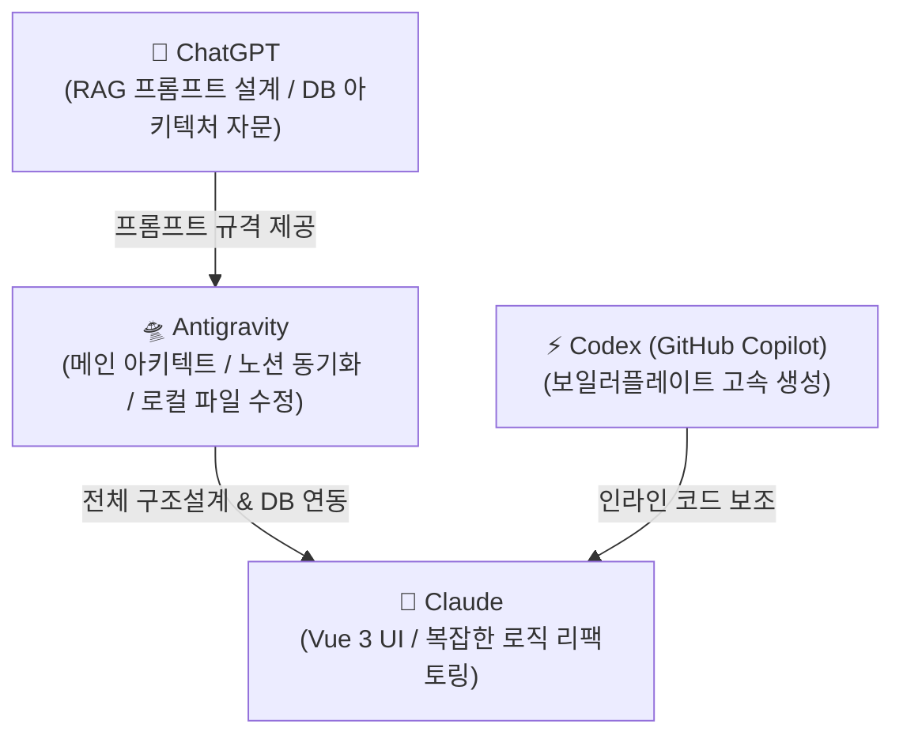

# 🛸 AI 협업 및 태스크 수행 지침 (AI Harness)

본 문서는 **뉴스 기반 경제 학습 서비스(Newsense)** 프로젝트 개발에 참여하는 AI 어시스턴트(Antigravity, Claude, ChatGPT, Codex)가 스스로를 제어(Harness)하고 시스템 요구사항 및 협업 컨벤션을 엄격하게 준수하여 일관성 있게 협업하기 위해 선언된 **AI 행동 강령 및 작업 가이드라인**입니다.

이후 모든 AI 어시스턴트(특히 Antigravity)는 태스크를 부여받을 때 이 하네스 문서를 가장 먼저 로드하여 본인의 역할과 규칙을 확인하고 준수해야 합니다.

---

## 👥 1. AI 어시스턴트 역할 분담 및 협업 프로세스

각 AI는 자신의 고유 강점을 극대화하여 작업에 임하며, 상호 영역을 침범하지 않고 보완하도록 협업합니다.



* **안티그래비티 (Antigravity)**
  * **주요 역할**: 프로젝트 메인 아키텍트 & 프로젝트 허브(노션) 실시간 동기화 및 파일 관리.
  * **주요 태스크**: 로컬 파일 시스템 직접 탐색 및 코드 수정, 패키지 기본 구조 및 DB Entity 생성, 노션 스펙과 로컬 코드의 연동 갱신.
* **클로드 (Claude)**
  * **주요 역할**: UI/UX 화면 구현 및 복잡한 비즈니스 로직 리팩토링 스페셜리스트.
  * **주요 태스크**: Vue 3 Composition API 컴포넌트 마크업, Tailwind CSS 반응형 UI 구현, 백엔드 RAG 프롬프트 파이프라인 리팩토링.
* **챗지피티 (ChatGPT)**
  * **주요 역할**: AI 프롬프트 엔지니어링 및 RAG 백엔드 기술 아키텍처 자문.
  * **주요 태스크**: JSON 구조 출력 보장용 System/User 프롬프트 설계, MySQL 및 MongoDB 쿼리 최적화 설계 자문.
* **코덱스 (Codex / GitHub Copilot)**
  * **주요 역할**: IDE 내 실시간 인라인 코드 자동완성 및 보일러플레이트 고속 생성.
  * **주요 태스크**: DTO, JPA Repository, Controller 매핑 선언 및 단순 반복 코드의 빠른 생성 지원.

---

## 🏗️ 2. 핵심 아키텍처 및 RAG 데이터 흐름 제어

모든 백엔드 기능 개발 및 데이터베이스 제어 시 아래 아키텍처 규칙을 엄격하게 적용합니다.

### 2.1 데이터베이스 분리 정책
* **MongoDB**: 비정형 뉴스 원본 및 뉴스 청킹(Chunking) 데이터 적재. (공공누리 제1유형 보도자료 JSoup 크롤링 활용)
* **MySQL**: 회원 관리, 퀴즈, 리뷰, 학습 이력 등의 핵심 비즈니스 관계형 데이터 저장.

### 2.2 RAG 및 보안 프로세스
* **RAG 및 AI 기능**: 사용자가 작성한 리뷰/오답에 기반하여 피드백이나 개념 설명 제공 시, MongoDB와 MySQL에서 추출한 관련 텍스트 데이터를 프롬프트에 주입하여 OpenAI GPT-4o mini를 통해 동적으로 정답 및 해설을 도출함.
* **네트워크 보안 격리**: AWS EC2 Docker 환경하에서 MySQL 및 MongoDB의 외부 호스트 포트 바인딩(Expose)은 금지함. 오직 Cloudflare Tunnel(SSL)만 외부 인바운드 트래픽을 수신하도록 세팅하고, DB 포트 스캔 및 외부 공격을 원천 차단함.

---

## 🎨 3. Git 및 협업 컨벤션

### 3.1 브랜치 전략 (Git Flow)
* 모든 기능 개발은 `develop` 브랜치에서 분기하여 `feature/기능명` 또는 `feature/issue-번호` 포맷으로 브랜치를 만들어 작업합니다.
* `main` 브랜치에 직접 푸시(push)하는 것은 금지하며, PR을 통한 병합(Squash Merge)만 허용합니다.

### 3.2 커밋 메시지 규격
* 커밋 메시지는 반드시 아래 깃모지(Gitmoji) 형식을 엄격하게 준수합니다.
  ```plain text
  :gitmoji: type : subject (#이슈번호)
  ```
  * *예시: `✨ feat : RAG 퀴즈 생성 API 구현 (#15)`*
* 주요 Gitmoji 타입: `✨ feat`, `🐛 fix`, `📝 docs`, `💄 style`, `♻️ refactor`, `✅ test`, `🔧 chore`

### 3.3 PR(Merge Request) 규칙
* 하나의 PR은 하나의 기능 또는 하나의 버그 수정 단위로 분리하며, 변경 라인은 300줄 이하를 권장합니다.
* PR 생성 시 CodeRabbit AI가 자동으로 코드 리뷰를 진행하며, 지적 사항이 반영되거나 합당한 코멘트가 달린 후 병합합니다.

---

## 💻 4. 언어 및 프레임워크 표준 규칙

### 4.1 Java / Spring Boot 4.1.0 (Java 21)
* **네이밍**: 클래스는 `PascalCase`, 메서드와 변수는 `camelCase`, 상수는 `UPPER_SNAKE_CASE`를 사용합니다.
* **의존성 주입**: `@RequiredArgsConstructor`를 활용한 생성자 주입을 필수로 하며, 필드 주입(`@Autowired`)은 금지합니다.
* **API 공통 응답**: 모든 API 응답은 `ApiResponse<T>` 규격을 준수하여 출력합니다.
  ```json
  {
    "success": true,
    "code": 200,
    "message": "메시지",
    "data": { ... }
  }
  ```

### 4.2 Vue 3 / Frontend
* **컴포넌트**: `PascalCase` 명명법(예: `QuizCard.vue`)을 사용하며, 페이지 컴포넌트는 `View` 접미사를 붙입니다.
* **API 사용**: Composition API (`<script setup>`)를 명시적으로 사용하며, API 호출 로직은 스토어나 컴포저블로 분리합니다.
* **상태 관리**: Pinia를 사용하며 `useUserStore`와 같이 `use` 접두사를 사용합니다.
